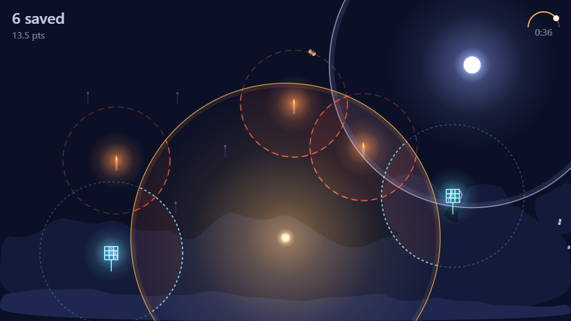

[English](README.md) | [한국어](README.ko.md) | [日本語](README.ja.md) | [简体中文](README.zh-CN.md) | **Español**

# AI Game Studio — una skill de Claude Code

_Esta es una traducción. Si difiere del README en inglés, prevalece la versión en inglés._

Convierte Claude Code en un estudio de videojuegos: un agente **Producer** dirige un equipo de subagentes con roles —
Director Creativo, Diseñador de Juego, Líder Técnico, Programadores de Gameplay/UI/Motor, Artistas 2D/3D/Técnicos,
Audio, Guionista, QA, Build— que planifican, construyen, revisan y hacen playtest de un juego en conjunto.
Motores: **Godot, Unity, Unreal, Web**. Alcance: desde un juego de game jam de un día hasta proyectos grandes con múltiples hitos.

Tú eres el **Boss**. Lo ves todo en directo y puedes interrumpir en cualquier momento.



## Qué obtienes

- **Panel local** (`http://127.0.0.1:4747`, sin dependencias)
  - **Chat** — canales al estilo de Slack por equipo (`#design #engineering #art #audio #qa #build #approvals #blockers`), mensajes directos, `@mentions`. Publica como Boss; los workers lo ven en su siguiente check-in.
  - **Tablero** — kanban al estilo de Jira con épicas, hitos, prioridades, dependencias y **criterios de aceptación**. Un ticket no puede cerrarse hasta que se marquen todos sus criterios.
  - **Equipo** — quién está trabajando ahora mismo, en qué ticket y cuál fue su última acción.
  - **Uso** — tokens y coste estimado según precios de lista de la API, por equipo / worker / hito / ticket (leído de las transcripciones de Claude Code).
  - **Aprobaciones** — cada gasto, inicio de sesión o descarga de modelo espera a que pulses Aprobar/Denegar.
  - **Documentos** — pitch, GDD, TDD, registro de decisiones, lecciones.
  - Botones: **Pausar · Reanudar · Detener · Playtest · Directiva**.
- **CLI del estudio** (`server/studio.js`) — la única vía por la que los workers modifican el estado compartido, de modo que el plan vive en los tickets y no en la ventana de contexto de nadie.
- **Proceso** — pitch → GDD → puerta del Boss → TDD con un mapa de propiedad de archivos → sprints en paralelo sobre archivos disjuntos → revisión de QA con evidencias → puerta de playtest → retrospectiva.
- **Autoactualización** — los workers registran lecciones cuando resuelven algo no evidente; los bucles (el mismo error 3 veces, un ticket rechazado 3 veces) se marcan automáticamente; en cada retrospectiva el Producer incorpora las lecciones a los playbooks y a los briefs de cada rol, y actualiza el changelog en `SKILL.md`.
- **Política de assets** — se permiten fuentes gratuitas/CC0, Blender (vía Blender MCP) y ComfyUI local; las herramientas de IA de pago (ElevenLabs, Higgsfield, Rodin/Hunyuan3D, …), los inicios de sesión y las descargas grandes siempre pasan por una solicitud de aprobación. Los agentes nunca escriben credenciales.

## Instalación

Requiere [Claude Code](https://docs.claude.com/en/docs/claude-code) y Node.js 18+.

```bash
git clone https://github.com/mhwangbo/ai-game-studio.git ~/.claude/skills/game-studio
```

La carpeta debe llamarse `game-studio` y estar dentro de `~/.claude/skills/` (la documentación hace referencia a `$HOME/.claude/skills/game-studio`).

## Uso

En cualquier carpeta, pídele a Claude Code algo como:

> inicia el game studio y crea un juego web pequeño pero original

El Producer inicializa `<Game>/.studio/`, arranca el panel, hace el kickoff y te consulta en cada puerta.
Abre **http://127.0.0.1:4747** para observar y dirigir.

También puedes manejar la CLI tú mismo:

```bash
node ~/.claude/skills/game-studio/server/studio.js --project MyGame board
node ~/.claude/skills/game-studio/server/studio.js --project MyGame who
node ~/.claude/skills/game-studio/server/studio.js help
```

## Estructura

```
SKILL.md            Producer playbook (boot, kickoff, sprint loop, spawning workers, controls, self-update)
server/             studio.js (CLI + state), studio-server.js (dashboard), usage.js (transcript usage), ui/index.html
roles/              one brief per role: owns, outputs, definition of done
playbooks/          engines (godot/unity/unreal/web), assets (free, blender, comfyui, paid), QA, playtest, scale tiers
templates/          GDD, TDD, ticket, milestone, default studio config
lessons/LESSONS.md  append-only log of blockers and fixes — the studio's memory
examples/mothlight  a game made end-to-end by the studio (see below)
```

El estado de cada juego vive en `<game>/.studio/` (JSON + JSONL): configuración, tickets, canales de chat, workers, aprobaciones, hitos y decisiones.

## Ejemplo: Mothlight

Un pequeño juego web creado por el estudio en una sola sesión: eres un farol en un jardín nocturno; brilla para atraer a las polillas y apágate para dejar que vuelen hacia la luz más brillante (la luna las salva; las velas y los matamosquitos eléctricos no).
8 agentes, 20 tickets, 2 hitos, 2 playtests del Boss. Gráficos procedurales y audio sintetizado, sin assets externos.

```bash
python -m http.server 8080 --directory examples/mothlight/game
```

Después abre http://localhost:8080 (los módulos ES necesitan http, no `file://`). Los documentos de diseño están en `examples/mothlight/docs/`.

## Playtesting: playtest-lab (opcional)

[playtest-lab](https://github.com/mhwangbo/playtest-lab) es un proyecto complementario con su propio repositorio. Añade bots jugadores deterministas y personas de IA que prueban builds de web, Unity y Godot, además de un informe `playtest-report/1`.

Cuando está instalado como la skill `playtest-lab`, la puerta de playtest del estudio (`playbooks/playtest.md`) lo ejecuta y convierte los `suggestedTicket`s del informe en tickets, y el lab replica los resúmenes en `#qa`. Sin él, el estudio funciona exactamente igual que antes.

## Estado

- **Probado de principio a fin:** tier web / jam (Mothlight): kickoff, sprints en paralelo, bucle de rechazo de QA → corrección, puertas del Boss, interrupciones mediante pausa/directiva/chat, incorporación de lecciones.
- **Escrito pero aún no probado a fondo:** playbooks de Godot, Unity y Unreal, pipelines de assets con Blender/ComfyUI, tiers más grandes. Es de esperar que las primeras ejecuciones ahí generen lecciones; para eso existe el bucle de autoactualización.
- Los costes de uso son **estimaciones** según precios de lista de la API (consulta `server/usage.js`; se pueden sobrescribir con `pricing` en `.studio/config.json`); los planes de suscripción no se facturan por token.
- El panel solo escucha en `127.0.0.1` y no tiene autenticación: no lo expongas a una red.

## Licencia

MIT
